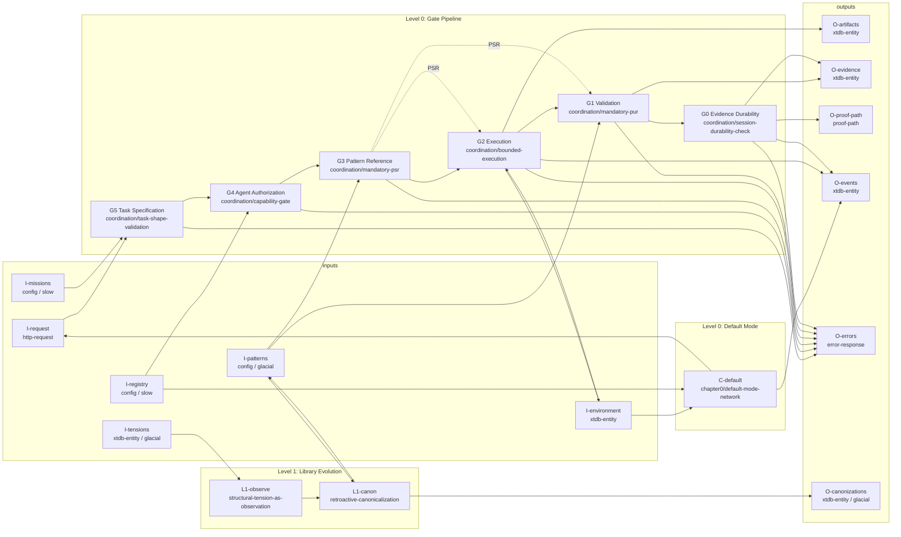

# Mission: Coordination Rewrite

Rewrite futon3's coordination layer as a six-gate pipeline operating over a
unified typed graph, composing futon3's active components (P0-P5) with
futon3a's inference rules (typed arrows, validation pipeline, chain scoring)
through the 12 coordination patterns derived from futon-theory.

This mission is the INSTANTIATE step of the derivation xenotype:
IDENTIFY -> MAP -> DERIVE -> ARGUE -> VERIFY -> **INSTANTIATE**.

## Owner

Claude (with Codex as primary implementer for Part II code modules).

## Reviewer

Codex reviews Part I process artifacts.
Claude reviews Part II code for pattern conformance and gate integrity.
Cross-validation per `coordination/cross-validation-protocol`.

## Scope

### Scope In

- Part I: Composition plan — map futon3 components and futon3a inference rules
  to the gate pipeline, with PSR/PUR exemplars and traceability gates.
- Part II: Implement the gate pipeline as `futon3.gate.*` namespaces, composing
  existing code rather than replacing it.
- Part III: Wire Level 1 (glacial loop) — tension observer and canonicalizer
  that close the library evolution feedback loop.
- Produce the minimum artifacts needed to make gate invariants verifiable:
  gate rejection catalog, evidence shape catalog, integration test harness.

### Scope Out

- Rewriting futon3's MUSN transport (P0) — it stays as the IO layer.
- Rewriting futon3a — its modules are composed, not replaced.
- UI beyond existing HTTP/WS surfaces.
- Joy metrics (P8) and training ground (P10) — they fall out as consequences
  but are separate missions.
- More than 5 success criteria per prototype gate — split if exceeded
  (per `futon-theory/mission-scoping`).

## Time Box

3 weeks to complete Part I gate and land Prototype 0 (gate pipeline scaffold
with all six gates rejecting malformed input, no Level 1 yet).

## Exit Conditions

- Part I gate is satisfied with concrete artifacts (composition map,
  evidence shapes, PSR/PUR exemplars, traceability chain).
- Prototype 0: all six gates enforce their patterns and produce structured
  rejections. Integration test exercises the full G5->G0 path.
- The exotype diagram (`coordination-exotype.edn`) validates the prototype
  via `ct/mission.clj` — all 8 checks pass on the concrete instantiation.

## Interface Signature

### Mission Diagram



### Input Ports

| Port | Type | Source | Timescale | Constraint? | Description |
|------|------|--------|-----------|-------------|-------------|
| `I-request` | `http-request` | human / mission queue / peer agent | fast | no | Raw work request to be coordinated |
| `I-environment` | `xtdb-entity` | codebase / project state / running services | fast | no | What agents observe and act upon |
| `I-missions` | `config` | mission specs / devmap | slow | yes | What counts as success |
| `I-patterns` | `config` | `library/**/*.flexiarg` | glacial | yes | How to do things well (dual role: constraint for L0, environment for L1) |
| `I-registry` | `config` | agent registry / capability declarations | slow | yes | Who can do what |
| `I-tensions` | `xtdb-entity` | accumulated gap-PSRs / PARs / cross-repo evidence | glacial | no | Observation vector for library evolution |

### Output Ports

| Port | Type | Consumer | Spec Ref | Description |
|------|------|----------|----------|-------------|
| `O-artifacts` | `xtdb-entity` | codebase / review | `coordination/artifact-registration` | What the coordinated work produced |
| `O-evidence` | `xtdb-entity` | pattern library / meta-learning | `coordination/par-as-obligation` | PSR/PUR/PAR records documenting pattern use |
| `O-proof-path` | `proof-path` | audit / replay / reconstruction | `coordination/session-durability-check` | Audit trail: when you cross the gate, there is still a path to replay |
| `O-events` | `xtdb-entity` | monitoring / diagnostics / forum | `futon-theory/event-protocol` | Observable telemetry |
| `O-errors` | `error-response` | human / retry / monitoring | `futon-theory/error-hierarchy` | Structured gate rejections with gate attribution |
| `O-canonizations` | `xtdb-entity` | pattern library / genealogy graph | `futon-theory/retroactive-canonicalization` | Library evolution actions (glacial) |

### Composition Constraint

Every output port must be:
1. **Specified** in a coordination pattern (spec-ref column)
2. **Implemented** in a gate module (`futon3.gate.*`)
3. **Tested** (at least one test exercises the port)
4. **Traceable** to the exotype diagram (edge in `coordination-exotype.edn`)

If an output port exists in code but not in the exotype diagram, that is a
stop-the-line violation (`futon-theory/stop-the-line`).

## Argument (Pattern-Backed)

The full argument is in `library/coordination/ARGUMENT.flexiarg`. Summary:

Futon3's IFR says it should "turn messy activity into organised knowledge by
checking work against shared patterns and producing auditable records." The
current architecture cannot do this because its knowledge is scattered across
disconnected stores — the pattern store in futon1, typed arrows in futon3a's
SQLite, trails in futon3's event log, and session evidence in flat files.

The coordination patterns (12 patterns across 6 gates) specify a pipeline
that enforces pattern use, validates outputs, and persists evidence. Futon3a
already provides much of the pipeline infrastructure (typed arrows, validation
schemas, chain scoring, compass navigation) under different names. The rewrite
composes these existing bodies of work through a unified gate pipeline into a
single typed graph.

The coordination system is a two-level AIF wiring diagram: a fast loop
governing task execution through the gate pipeline and a glacial loop
governing library evolution through canonicalization, sharing the same
boundary. The AIF framework provides six checkable invariants (I1-I6) that
the rewrite must satisfy at both levels. The abstract diagram
(`coordination-exotype.edn`) passes all 8 machine checks via `ct/mission.clj`.

Pattern references:

- Gate patterns: `library/coordination/*.flexiarg` (12 patterns, 2 per gate)
- Theory patterns: `library/futon-theory/task-as-arrow.flexiarg`,
  `library/futon-theory/retroactive-canonicalization.flexiarg`,
  `library/futon-theory/structural-tension-as-observation.flexiarg`
- AIF specification: `futon5/docs/chapter0-aif-as-wiring-diagram.md`
- Exotype diagram: `futon5/data/missions/coordination-exotype.edn`
- Concrete diagram: `futon5/data/missions/futon3-coordination.edn`
- Full argument: `library/coordination/ARGUMENT.flexiarg`
- Gate mapping: `futon5/docs/gate-pattern-mapping.md`

## Part I: Composition Plan

### 1.1 Composition Map

The rewrite composes, not replaces. Each gate maps to existing futon3 and
futon3a components:

| Gate | futon3 Component | futon3a Component | New Code |
|------|------------------|-------------------|----------|
| G5 Task Specification | P4 Workday bridge (entry point) | `sidecar.validation` (shape enforcement) | `gate.task` — shape validation + mission binding |
| G4 Agent Authorization | — (no current model) | — | `gate.auth` — registry lookup + capability match |
| G3 Pattern Reference | P1 Pattern store + P5 Similarity field | `futon.notions` (search) + `futon.compass` (navigation) | `gate.pattern` — PSR creation + search protocol |
| G2 Execution | P2 Check DSL (evaluation engine) | `meme.arrow` (typed edges) + `sidecar.store` (proposal pipeline) | `gate.exec` — bounded execution + artifact registration |
| G1 Validation | P3 Trails (session records) | `sidecar.validation` (schema) + `meme.arrow/chain-score` (quality) | `gate.validate` — PUR creation + cross-validation |
| G0 Evidence Durability | — (ad hoc persistence) | — | `gate.evidence` — durability check + PAR obligation |

### 1.2 Evidence Shape Catalog

Each gate produces typed evidence records. These are the morphisms in the
gate pipeline:

| Record | Produced At | Shape | Consumed By |
|--------|-------------|-------|-------------|
| Task Spec | G5 | `{:task/id, :task/mission-ref, :task/scope, :task/typed-io, :task/success-criteria, :task/intent}` | G4, G3, G2 |
| Assignment | G4 | `{:assign/agent-id, :assign/task-id, :assign/capabilities, :assign/exclusive?}` | G2 |
| PSR | G3 | `{:psr/id, :psr/task-id, :psr/pattern-ref, :psr/candidates, :psr/rationale, :psr/type [:selection :gap]}` | G2, G1 |
| Artifact | G2 | `{:artifact/id, :artifact/task-id, :artifact/type, :artifact/ref, :artifact/registered-at}` | G1, G0 |
| PUR | G1 | `{:pur/id, :pur/psr-ref, :pur/criteria-eval, :pur/outcome, :pur/prediction-error}` | G0 |
| PAR | G0 | `{:par/id, :par/session-ref, :par/what-worked, :par/what-didnt, :par/prediction-errors, :par/suggestions}` | L1 (via O-evidence → I-tensions) |

### 1.3 Theory Grounding

The gate pipeline implements futon-theory axioms:

| Axiom | Requirement | Gate Implementation |
|-------|-------------|---------------------|
| A1: Auditability | Every operation traceable | Proof-path through all six gates; G0 persists the full path |
| A2: Attributable | Changes have clear source | G4 assigns agent; G2 registers artifacts with agent attribution |
| A3: Evidence-driven | Progression requires proof | G3 requires PSR before execution; G1 requires PUR after |
| A4: Degradation detectable | Failures surface early | Each gate can reject; errors carry gate attribution |
| A5: Minimum events | Log what's needed | Evidence shapes are typed and minimal; no verbose logs |

Chapter 0 invariants (from `chapter0-aif-as-wiring-diagram.md`):

| Invariant | Statement | How Enforced |
|-----------|-----------|--------------|
| I1: Boundary | The gate pipeline IS the system boundary | All work enters through G5, exits through G0 |
| I2: Observation-action asymmetry | Only G2 touches the environment | Other gates read config/evidence only |
| I3: Timescale separation | Slow constrains fast | Missions (slow) → G5; Patterns (glacial) → G3, G1; Registry (slow) → G4 |
| I4: Preference exogeneity | No fast→constraint path | No output feeds back to missions/patterns/registry at fast timescale |
| I5: Model adequacy | Models match environment | PSR selection matches task shape; PUR evaluates outcome |
| I6: Compositional closure | System sustains without deliberation | C-default provides inter-task baseline behavior |

### 1.4 Dual Interpretation

Each gate mediates between agent problems and pattern problems (from
`coordination/INDEX.md`):

| Gate | Agency Reading | Pattern Reading |
|------|---------------|-----------------|
| G5 | Is the agent's task well-defined? | Is the task shaped so a pattern can guide it? |
| G4 | Can this agent do this work? | Does this pattern apply to this domain? |
| G3 | Has the agent committed to an approach? | Has a pattern been engaged with? |
| G2 | Agent stays within budget | Pattern application stays within scope |
| G1 | Agent's work gets evaluated | Pattern's guidance gets evaluated |
| G0 | Agent's session is recoverable | Pattern use evidence is persistent |

### 1.5 Traceability Chain

Every design decision must trace from devmap through pattern to code:

```
devmap → coordination-pattern → theory-pattern → exotype-edge → gate-module → test → evidence-shape → error
futon3.devmap:IFR → coordination/mandatory-psr → futon-theory/task-as-arrow → G3→G2:http-request → gate.pattern/select! → test/gate/pattern_test.clj → {:psr/id ...} → G3/PATTERN_NOT_FOUND
```

### 1.6 PSR/PUR Storage

Following futon1a convention:

1. Location: `holes/labs/coordination/psr/` and `holes/labs/coordination/pur/`.
2. Filename: `YYYY-MM-DD__<gate>__<pattern>.md`.
3. Required fields: context, pattern, decision, alternatives, outcome, evidence link.

### 1.7 Part I Gate (Process Acceptance)

Do not begin Part II until all items are satisfied:

1. Composition map complete and reviewed (§1.1).
2. Evidence shape catalog defines all inter-gate record types (§1.2).
3. Theory grounding maps each axiom and invariant to gate behavior (§1.3).
4. At least one PSR + PUR exemplar exists (§1.6).
5. Traceability example present (devmap → pattern → exotype → gate → test → evidence → error).
6. Reviewer (Codex) has signed off on Part I artifacts.

---

## Part II: Gate Pipeline Implementation

The gate pipeline composes existing code through a unified namespace structure.
Part II is constrained by the coordination-exotype diagram (the exotype) and
instantiates the 12 coordination patterns (the genotype) as working code
(the phenotype).

### 2.1 Namespace Layout

```
futon3.gate.task       ;; G5 — task-shape-validation, intent-to-mission-binding
futon3.gate.auth       ;; G4 — capability-gate, assignment-binding
futon3.gate.pattern    ;; G3 — mandatory-psr, pattern-search-protocol
futon3.gate.exec       ;; G2 — bounded-execution, artifact-registration
futon3.gate.validate   ;; G1 — mandatory-pur, cross-validation-protocol
futon3.gate.evidence   ;; G0 — session-durability-check, par-as-obligation
futon3.gate.pipeline   ;; G5→G0 composition (BHK arrow composition)
futon3.gate.default    ;; C-default — inter-task baseline behavior
futon3.gate.shapes     ;; Evidence shape specs (shared across gates)
futon3.gate.errors     ;; Gate rejection catalog
```

### 2.2 Gate Error Catalog

Every gate rejection has a typed error with gate attribution. Following
futon1a's error hierarchy:

| Gate | Error Key | HTTP Status | Meaning |
|------|-----------|-------------|---------|
| G5 | `:g5/missing-mission-ref` | 400 | Task has no mission reference |
| G5 | `:g5/missing-success-criteria` | 400 | Task has no success criteria |
| G5 | `:g5/mission-not-active` | 400 | Referenced mission is not in `:active` state |
| G4 | `:g4/agent-not-registered` | 403 | Agent not in registry |
| G4 | `:g4/capability-mismatch` | 403 | Agent lacks required capabilities |
| G4 | `:g4/already-assigned` | 409 | Task already assigned to another agent |
| G3 | `:g3/no-psr` | 400 | No PSR provided and no gap declaration |
| G3 | `:g3/pattern-not-found` | 404 | Referenced pattern not in library |
| G2 | `:g2/budget-exceeded` | 408 | Execution budget (time/tokens) exceeded |
| G2 | `:g2/artifact-unregistered` | 500 | Produced artifact not registered in graph |
| G1 | `:g1/no-pur` | 400 | No PUR produced for PSR |
| G1 | `:g1/criteria-not-met` | 422 | Success criteria evaluation failed |
| G0 | `:g0/durability-failed` | 503 | Evidence not persisted |
| G0 | `:g0/no-par` | 400 | No PAR produced before session close |

### 2.3 Tension Resolutions

These design decisions resolve the tensions from the ARGUMENT (E1-E7):

| Tension | Resolution | Pattern |
|---------|------------|---------|
| E1: Pattern store disconnected from phylogeny | Compose P1 (patterns) + futon3a arrows into one graph | `coordination/mandatory-psr` |
| E2: Checks don't enforce pattern selection | G3 makes PSR mandatory before G2 executes | `coordination/mandatory-psr` |
| E3: Trails lack typed evidence | Evidence shapes at each gate produce typed, linked records | `coordination/mandatory-pur` |
| E4: Workday input unvalidated | G5 validates task shape before pipeline proceeds | `coordination/task-shape-validation` |
| E5: Search not wired to pipeline | G3 wraps notions/compass search in a gate with PSR output | `coordination/pattern-search-protocol` |
| E6: Greenfield prototypes stalled | They fall out as graph queries once pipeline + graph exist | composition (§1.1) |
| E7: Graph convergence unexploited | futon3a inference rules become the edge types in the unified graph | `futon-theory/task-as-arrow` |

#### 2.3.1 Tension → Module → Test Mapping

| Tension | Module(s) | Test(s) |
|---------|-----------|---------|
| E1: Disconnected stores | `gate.pattern`, `gate.shapes` | `test/gate/pattern_test.clj` |
| E2: No mandatory PSR | `gate.pattern`, `gate.pipeline` | `test/gate/pipeline_test.clj` |
| E3: Untyped trails | `gate.validate`, `gate.evidence` | `test/gate/evidence_test.clj` |
| E4: Unvalidated tasks | `gate.task` | `test/gate/task_test.clj` |
| E5: Unwired search | `gate.pattern` | `test/gate/pattern_search_test.clj` |
| E6: Stalled greenfield | `gate.pipeline` (enables P6-P11) | `test/gate/pipeline_integration_test.clj` |
| E7: Separate graph | `gate.shapes`, `gate.exec` | `test/gate/graph_test.clj` |

### 2.4 Composition from Existing Code

The gate modules compose existing implementations:

```
gate.task:
  wraps: sidecar.validation (shape checking)
  calls: futon3 mission store (mission-ref lookup)
  new:   mission-binding check, intent extraction

gate.auth:
  new:   agent registry, capability matching, exclusive assignment
  reads: I-registry (config)

gate.pattern:
  wraps: futon.notions (keyword + embedding search)
  wraps: futon.compass (GFE-inspired navigation)
  wraps: futon3 P1 pattern store (pattern entities)
  calls: futon3a meme.arrow (phylogeny traversal)
  new:   PSR shape creation, gap declaration, search logging

gate.exec:
  wraps: futon3 P2 check DSL (evaluation)
  wraps: futon3a sidecar.store (proposal→fact pipeline)
  calls: futon3a meme.arrow (typed edge creation)
  new:   budget enforcement, artifact registration

gate.validate:
  wraps: futon3a sidecar.validation (schema enforcement)
  wraps: futon3a meme.arrow/chain-score (quality scoring)
  new:   PUR shape creation, cross-validation dispatch

gate.evidence:
  calls: futon1a durability layer (proof-path persistence)
  new:   session durability check, PAR obligation enforcement
```

### 2.5 Testing Strategy

**Gate tests** (fast, isolated):
- Does G5 reject tasks without mission-ref?
- Does G4 reject unregistered agents?
- Does G3 reject tasks without PSR or gap declaration?
- Does G2 halt on budget exceeded?
- Does G1 reject when success criteria fail?
- Does G0 reject when evidence not persisted?

**Pipeline tests** (integration):
- Full G5→G0 path with valid input produces proof-path
- First failing gate short-circuits; later gates never run
- Error carries gate attribution (which gate rejected)

**Cross-gate evidence tests**:
- PSR created at G3 is available at G1 for PUR creation
- PUR created at G1 is available at G0 for PAR creation
- Proof-path at G0 contains all evidence from all gates

**Exotype conformance test**:
- Run `ct/mission.clj` validators against the concrete instantiation
- All 8 checks pass (completeness, coverage, orphans, type safety,
  spec coverage, I3, I4, I6)

### 2.6 Part II Gate (Code Acceptance)

Do not begin Part III until:

1. All six gate namespaces exist with pattern/theory header references.
2. Gate error catalog fully implemented (§2.2).
3. Pipeline composition test passes (G5→G0 with valid and invalid inputs).
4. Evidence shapes validate against `gate.shapes` specs.
5. Cross-gate evidence flow tested (PSR→PUR→PAR chain).
6. `ct/mission.clj` validates the concrete instantiation against the exotype.
7. Reviewer (Claude) has reviewed for pattern conformance.

---

## Part III: Level 1 — Library Evolution

The glacial loop. This is the Level 1 gap identified in structural
verification — the concrete diagram has all Level 0 roles but no
`L1-observe` or `L1-canon`. Part III closes that gap.

### 3.1 Tension Observer

`L1-observe` reads accumulated evidence (gap-PSRs, PARs, cross-repo
patterns) and produces structural tension observations using the three
criteria from `futon-theory/structural-tension-as-observation`:

1. **Structural irritation** (结构刺激): Recurring gap-PSRs across sessions
2. **Pre-symbolic pressure** (前符号压力): Tasks hard to scope/match/validate
3. **Trans-situational reappearance** (跨情境复现): Same fix in different contexts

Pattern: `futon-theory/structural-tension-as-observation`

### 3.2 Canonicalizer

`L1-canon` reads observed tensions + current library state and produces
canonization events following the three-step Baldwin cycle from
`futon-theory/retroactive-canonicalization`:

1. **NAMING**: Recurring practice gets a stable name
2. **SELECTION**: Named practice shows trans-situational reappearance
3. **CANALIZATION**: Selected practice constrains future work

The canonicalizer writes to `I-patterns` (the library). This is the glacial
loop closing — library evolution modifying the constraints that govern task
execution. I3 allows this: glacial → glacial. I4 is clean: no output port
reaches I-patterns through a fast path.

Pattern: `futon-theory/retroactive-canonicalization`

### 3.3 Part III Gate

1. Tension observer produces structured observations from accumulated evidence.
2. Canonicalizer produces canonization events that update the library.
3. Full loop test: gap-PSR accumulation → tension observation → canonization
   → library update → subsequent G3 uses the new pattern.
4. I3 check: all Level 1 edges are glacial→glacial.
5. I4 check: no fast output→I-patterns path.
6. `ct/mission.clj` validates the complete two-loop diagram.

---

## Success Criteria

### Part I (Process)
- [ ] Composition map maps all six gates to existing code (§1.1)
- [ ] Evidence shape catalog defines all inter-gate record types (§1.2)
- [ ] Theory grounding covers all 5 axioms and 6 invariants (§1.3)
- [ ] Traceability from devmap → pattern → exotype → gate → test → evidence → error
- [ ] PSR/PUR exemplar exists
- [ ] Reviewer sign-off on Part I artifacts

### Part II (Product)
- [x] All six gate namespaces implemented with pattern/theory headers (CP-1)
- [x] Gate error catalog fully implemented with gate attribution (CP-1: 14 error types)
- [x] Pipeline test: G5→G0 with valid input produces complete proof-path (CP-1, CP-2)
- [x] Pipeline test: first failing gate short-circuits, error carries gate id (CP-1)
- [x] Evidence shapes validate against specs (CP-1: Malli validation at each gate)
- [x] PSR→PUR→PAR chain tested end-to-end (CP-2: round-trip proof-path test)
- [x] `ct/mission.clj` validates concrete instantiation: 8/8 checks pass (CP-2b)
- [x] Reviewer sign-off on code (CP-2: Codex reviewed a78f2fc)

### Part III (Level 1)
- [ ] L1-observe produces structured tension observations
- [ ] L1-canon produces canonization events that update library
- [ ] Full glacial loop test: accumulate → observe → canonize → updated constraint
- [ ] I3/I4 checks pass for the two-loop diagram
- [ ] `ct/mission.clj` validates complete diagram: 8/8 checks pass

### Derivation Requirements
- [x] Every gate module cites its coordination patterns (2 per gate) (CP-1: ns docstrings)
- [ ] Every coordination pattern cites its theory grounding (axiom or invariant)
- [x] Every tension resolution (E1-E7) maps to module + test (CP-2: AGENTS.md traceability table)
- [ ] Trace: devmap IFR → coordination pattern → theory → exotype edge → gate → test

## Tri-Theory Interpretation

Every coordination pattern has three simultaneous readings, each backed by
existing infrastructure in a different repo:

| Theory | Substrate | Repo | What You Learn |
|--------|-----------|------|----------------|
| Prose | flexiarg (IF/HOWEVER/THEN/BECAUSE) | futon3/library/ | *Why* — intent, subtlety, rationale |
| Logic | core.logic (miniKanren) | futon3b (Prototype 0) | *What* — which entities satisfy or violate the pattern now |
| Tensor | wiring diagrams + eigendecomposition | futon5/ct/ + hexagram/ + wiring/ | *How much* — stability, spectral gap, robustness under perturbation |

These are not metaphors. They are three executable interpretations of the
same structural object:

- `coordination-exotype.edn` is simultaneously a categorical diagram
  (validated by `ct/mission.clj`), a logic program (queryable via
  core.logic), and a tensor network (decomposable via `hexagram/lift.clj`).
- Each coordination pattern (e.g. `mandatory-psr.flexiarg`) is simultaneously
  prose ("every task must carry a PSR"), a logic rule (`(nafc psr-for-task
  _ task)` finds violations), and a typed index in the tensor contraction
  (a missing PSR is a dangling index — dimension mismatch).

The tri-theory is not a feature of the rewrite — it is a consequence of the
futon stack's existing architecture. futon5 created the wiring diagram format
that `coordination-exotype.edn` uses. futon3's pattern library provides the
prose. futon3b's core.logic layer provides the logic. The coordination
rewrite is where all three interpretations converge on the same object
for the first time.

### Baldwin Cycle Through Three Theories

The flexiformal pathway (EXPLORE → ASSIMILATE → CANALIZE) passes through
all three theories:

```
EXPLORE      prose only          (ancestor pattern, informal)
ASSIMILATE   prose + logic       (flexiformal query, partially executable)
CANALIZE     prose + logic + tensor  (compiled gate, structurally certified)
```

A fully canalized pattern has all three readings. An ancestor has only
prose. The progression from one to three is the canalization pathway —
each theory added is a degree of freedom removed.

## Specification Reference

- **Abstract diagram (exotype):** `futon5/data/missions/coordination-exotype.edn`
- **Concrete diagram (Level 0):** `futon5/data/missions/futon3-coordination.edn`
- **Static analysis (existing):** `futon5/data/missions/futon3-agent-loop.edn`
- **Coordination patterns:** `library/coordination/INDEX.md`
- **Theory patterns:** `library/futon-theory/INDEX.md`
- **Gate mapping:** `futon5/docs/gate-pattern-mapping.md`
- **Full argument:** `library/coordination/ARGUMENT.flexiarg`
- **AIF specification:** `futon5/docs/chapter0-aif-as-wiring-diagram.md`
- **Validator:** `futon5/src/futon5/ct/mission.clj`
- **futon1a exemplar:** `holes/missions/M-futon1a-rebuild.md`

## Prototype 0: Unified Search (Bootstrapping Deliverable)

**Goal:** A query layer that reads across all five content stores and returns
results through a single interface. This is the first concrete deliverable
because:

1. It solves a real user need (finding past sessions by content).
2. It proves the composition approach (reading from five stores through one
   interface) before building the full gate pipeline.
3. The query language doubles as the testing language — gate invariants are
   queries over the evidence graph.

### The Five Stores

| Store | Technology | Content | Current Query Surface |
|-------|-----------|---------|----------------------|
| futon1a | XTDB (RocksDB) | Entities, relations, lab sessions, patterns-as-entities | ID lookup only |
| futon3a/memes | SQLite | Typed arrows, proposals, promotions, facts | SQL (internal) |
| futon3a/notions | ANN (MiniLM, GloVe) | Pattern embeddings | `notions/search` (patterns only) |
| library | Filesystem | `*.flexiarg` pattern source text | Manual browse |
| sessions | Filesystem (JSONL) | `~/.claude/projects/` session transcripts | `grep` |

### Query Interface

All queries are core.logic programs. Convenience wrappers provide common
patterns, but the underlying language is always relational.

```clojure
;; "Find the session where I talked about PlanetMath"
(run* [s snippet]
  (session s)
  (session-text s snippet)
  (texto snippet "PlanetMath"))

;; "How many sessions are open right now?"
(count
  (run* [s]
    (session s)
    (session-state s :open)))

;; "Which Codex sessions did I run yesterday?"
(run* [s]
  (session s)
  (session-agent s :codex)
  (session-date s #inst "2026-02-07"))
```

Results carry source attribution (which store the data came from):

```clojure
;; Federated query returning from multiple stores
(run* [source id snippet]
  (conde
    [(== source :xtdb)     (session id) (session-text id snippet)
                           (texto snippet "PlanetMath")]
    [(== source :transcript) (transcript id) (transcript-text id snippet)
                           (texto snippet "PlanetMath")]))
```

### Query as Test

The same language expresses gate invariant checks:

```clojure
;; G1 mandatory-pur: every PSR must have a matching PUR
(run* [psr]
  (psr-record psr)
  (nafc pur-for-psr _ psr))

;; G0 par-as-obligation: every closed session must have a PAR
(run* [s]
  (session s)
  (session-state s :closed)
  (nafc par-for-session _ s))

;; G4 capability-gate: assignments where agent lacks required capabilities
(run* [task agent]
  (assignment task agent)
  (fresh [cap]
    (task-requires task cap)
    (nafc agent-capability agent cap)))
```

When the gate pipeline lands (Part II), these queries become the test suite.
The search layer IS the validation layer — human-facing and machine-facing
queries through the same interface.

### Query Substrate: core.logic

The query layer is built on `core.logic` (miniKanren). Each store is exposed
as a set of relations; queries unify across stores through logic variables.

```clojure
;; Relations backed by different stores
(defrel entity e)          ;; futon1a/XTDB
(defrel session s)         ;; futon1a/XTDB
(defrel arrow a)           ;; futon3a/SQLite
(defrel pattern p)         ;; library/*.flexiarg (parsed, cached)
(defrel transcript t)      ;; ~/.claude/projects/*.jsonl (indexed)
(defrel agent ag)          ;; registry config
```

Queries unify across stores naturally:

```clojure
;; "Sessions with PARs where both Claude and Codex participated"
(run* [s]
  (session s)
  (fresh [par]
    (par-for-session par s)
    (par-participant par :claude)
    (par-participant par :codex)))
```

### Flexiformal Interpretation of Patterns

Coordination patterns written in flexiarg (IF/HOWEVER/THEN/BECAUSE) can be
partially interpreted as core.logic relations. This is the flexiformal
pathway — the route from informal prose to formal gate check, with query
as the middle ground.

Three readings of each pattern:

| Level | Reading | Example (`mandatory-psr`) |
|-------|---------|--------------------------|
| Informal | Prose | "Every task must carry a PSR before execution" |
| Flexiformal | core.logic query | `(run* [t] (task t) (nafc psr-for-task _ t))` → violations |
| Formal | Compiled gate | G3 rejects if no PSR (Part II) |

The IF/THEN maps to a logic rule. The HOWEVER captures subtlety that remains
prose (the case the rule must handle despite counterevidence). The BECAUSE is
queryable provenance ("why does this rule exist?"). The Baldwin cycle maps
onto this progression: EXPLORE (informal) → ASSIMILATE (flexiformal query) →
CANALIZE (compiled gate check).

Not every pattern reaches full formality. Some stay flexiformal — the HOWEVER
clause genuinely captures something the system can't formalize. But the
pathway exists, and each step adds machine-checkability without losing
human readability.

### Prototype 0 Exit Conditions

1. **Full-text search across XTDB** — query lab sessions, entities, and
   patterns by content. "Find the session where I talked about PlanetMath"
   returns results.
2. **Session transcript search** — index `~/.claude/projects/` JSONL files
   and return matches with file + line attribution.
3. **Federated relational query** — a single core.logic query returns
   results from multiple stores with source attribution. At minimum: XTDB +
   session transcripts in one query.
4. **Human-scale queries work** — "How many sessions are open?", "Which
   Codex sessions did I run yesterday?", "Which sessions have PARs with
   both Claude and Codex?" all return correct answers.
5. **At least one pattern-as-query** — a coordination pattern (e.g.
   `mandatory-psr`) partially interpreted as a core.logic relation and
   evaluated against real data from futon3's existing PSR/PUR files.
   This demonstrates that flexiformality is a pathway, not just a label.

### Scope Out (Prototype 0)

- Write path (no mutations — search is read-only).
- Gate pipeline (that's Part II).
- Full interpretation of all 12 patterns (one working example is enough).
- Embedding re-indexing (use existing MiniLM embeddings; new content gets
  keyword search only until re-indexed).
- Production HTTP endpoint (REPL-first; HTTP can come in Prototype 1).

## Checkpoints

### CP-0: Prototype 0 — Unified Search (2025-02-05)

Federated search across session transcripts and pattern library via core.logic
relations. `relations/search` returns results from both stores with source
attribution.

- **Built by:** Claude
- **Files:** `src/futon3b/query/transcript.clj`, `src/futon3b/query/relations.clj`
- **Verified:** session-count > 0, pattern-count > 0, cache invalidation, no fd leaks

### CP-1: Gate Scaffold (2025-02-06)

Full gate scaffold: 6 gate namespaces, pipeline composition, evidence shapes
(Malli), error catalog (14 types), utility namespace. 8 tests, 36 assertions.

- **Built by:** Codex (f0daac7, 395fd67)
- **Reviewed by:** Claude — found validate.clj shape-validation bypass (fixed)
- **Files:** `src/futon3/gate/*.clj`, `test/futon3/gate/pipeline_test.clj`

### CP-2: Store Integration + Gate Logic (2025-02-08)

Replaced injected stubs with real store calls. Gates read from and write to
actual stores; pipeline produces durable evidence.

- **Built by:** Claude (f3b6a1f, b9edd92)
- **Reviewed by:** Codex (a78f2fc) — hardened EDN I/O (`read-string` →
  `edn/read-string`), made paths repo-relative, made tests fully hermetic
- **Changes:**
  - G3 → real pattern library via `relations/pattern-exists?`
  - G5 → `data/missions.edn` via `relations/load-missions`
  - G0 → durable EDN sink via `relations/append-proof-path!`
  - G2 → passthrough artifact mode for pre-completed tasks
  - Proof-path store + query (`append-proof-path!`, `search-proof-paths`, `proof-patho`)
  - Mission registry (`data/missions.edn`)
- **Verified:** 17 tests, 54 assertions, 0 failures, 0 errors
- **Tensions resolved:** E2, E3, E4, E5. Partial: E1, E7. Remaining: E6

### CP-2b: Exotype Validation (2025-02-08)

Updated `futon5/data/missions/futon3-coordination.edn` to match actual
namespace names and set `:mission/state :active`. Ran `ct/mission.clj`:

```
{:all-valid true,
 :checks
 [{:valid true, :check :completeness}
  {:valid true, :check :coverage}
  {:valid true, :check :no-orphan-inputs}
  {:valid true, :check :type-safety}
  {:valid true, :check :spec-coverage}
  {:valid true, :check :timescale-ordering}
  {:valid true, :check :exogeneity}
  {:valid true, :check :compositional-closure}]}
```

8/8 checks pass. **Part II is now fully complete.**

---

## Derivation Provenance

This mission is the product of the derivation xenotype applied to the
coordination domain:

| Step | What Was Done | Artifact |
|------|---------------|----------|
| IDENTIFY | Audited ~39 ancestral patterns across 5 library directories | `futon5/docs/gate-pattern-mapping.md` §IDENTIFY |
| MAP | Mapped ancestors to six gates using proof path ↔ gate alignment | `futon5/docs/gate-pattern-mapping.md` §MAP |
| DERIVE | Wrote 12 coordination patterns (2 per gate) as flexiarg specs | `library/coordination/*.flexiarg` |
| ARGUE | Constructed argument from pattern conclusions + futon3a evidence | `library/coordination/ARGUMENT.flexiarg` |
| VERIFY (structural) | Translated to exotype diagram; 8/8 checks pass | `futon5/data/missions/coordination-exotype.edn` |
| VERIFY (empirical) | Traced git history; all 7 tensions + structural cycle confirmed | `ARGUMENT.flexiarg` §EMPIRICAL VERIFICATION |
| INSTANTIATE | This mission document | `holes/missions/M-coordination-rewrite.md` |

The derivation xenotype (`futon-theory/xenotype-portability`) is the same
adaptation skeleton used for the futon1a storage domain. The coordination
domain is a second instantiation of the same xenotype — different domain,
same derivation structure, same verification methods.
